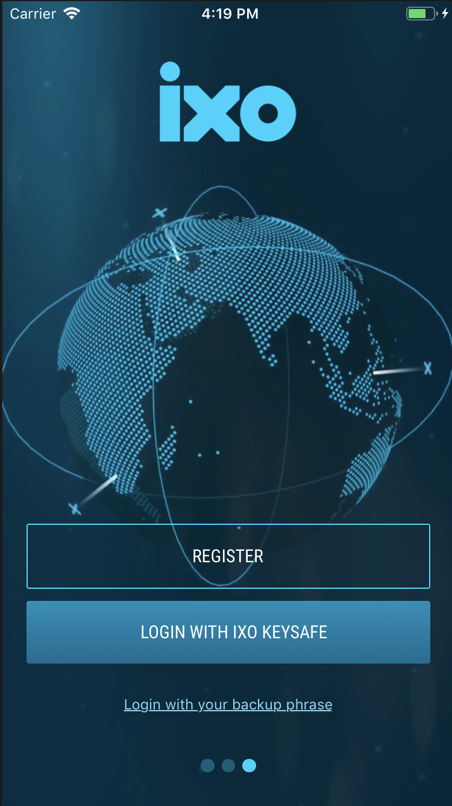
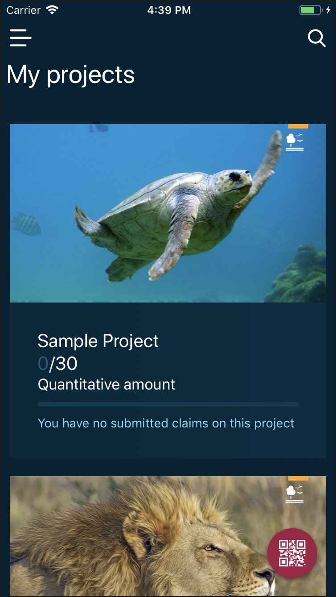
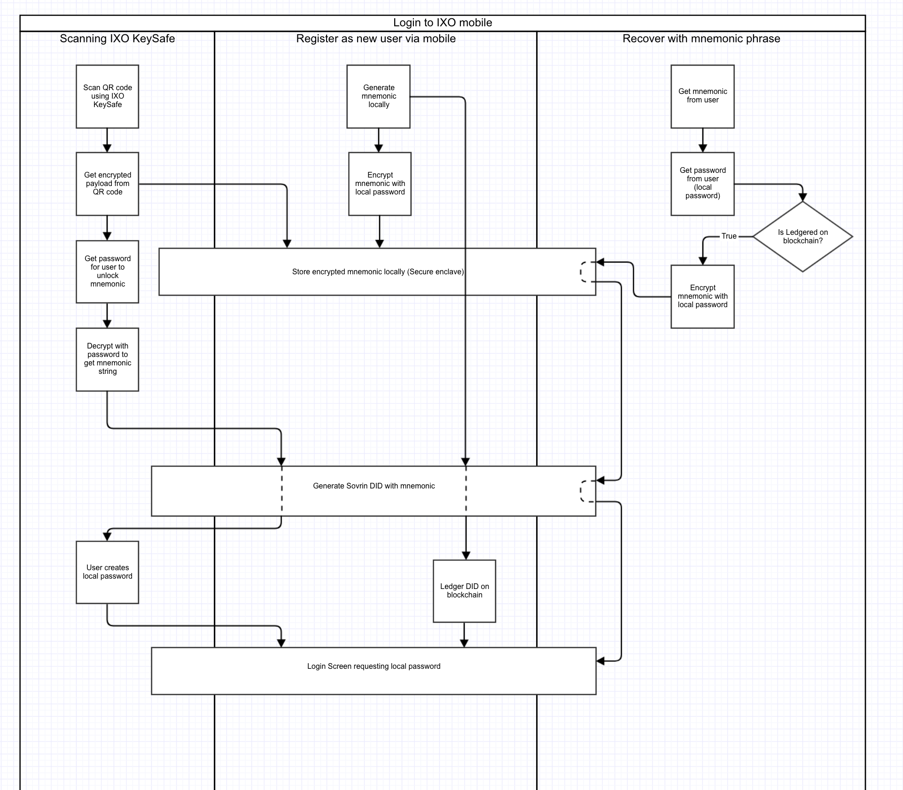

# ixo-Mobile
## Setup
Go to main project folder
```sh
yarn
```
For update pod file run next command

```sh
cd ios && pod install && cd ..
```

### Development

#### IOS

First you need to start Metro bundler 
```sh
npx react-native start
```
After that you could start iOS build
```sh
npx react-native run-ios
```

#### ANDROID

For Android platform use next command
```sh
npx react-native run-android
```

### Production

TODO:

## Screenshots



## Architecture

### Login security


## Native Libraries

* react-native-sensitive-info [https://www.npmjs.com/package/react-native-sensitive-info]
* react-native-camera [https://github.com/react-native-community/react-native-camera]
* react-native-permissions [https://github.com/yonahforst/react-native-permissions]
* react-native-image-picker
* react-native-fingerprint-scanner
* react-native-linear-gradient
* react-native-svg
* react-native-randombytes
* react-native-splash-screen
* react-native-video

## Contributing

Contributions welcome; Please submit all pull requests the against master branch. If your pull request contains JavaScript patches or features, you should include relevant unit tests. Please check the [Contributing Guidelines](contributng.md) for more details. Thanks!

## License

 - **MIT** : http://opensource.org/licenses/MIT